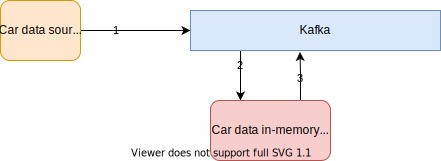
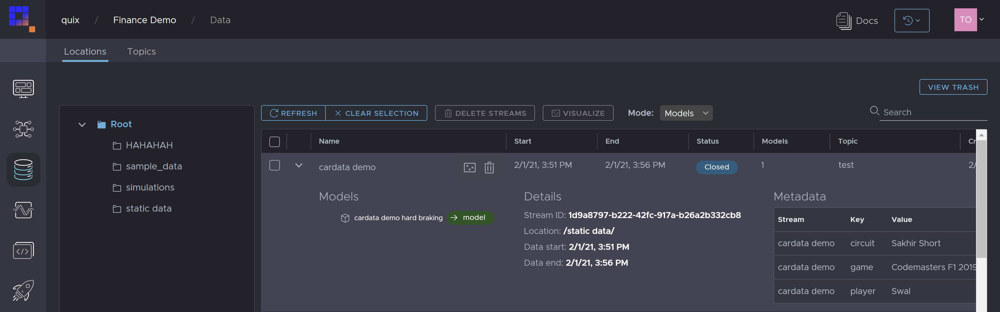
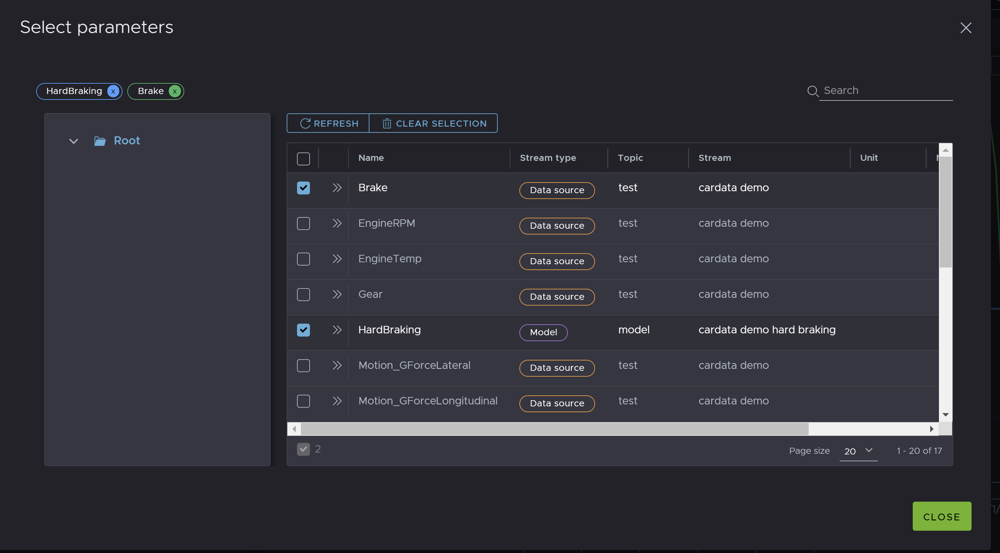

# Car data example model
Example code how to build simple in-memory function using Quix SDK on real-time data. The architecture is following:
 
[](car-demo-model.svg "Architecture") 

1) Car telemetry is streamed into input topic.
2) Model is subscribed to input topic and is reading data realtime into memory.
3) Result of model function is streamed to output topic

## Code walkthrow 

Each instance of model can proccess multiple streams. Quix SDK is designed to help you to react to each incoming stream in it's own scope. 
```python
# Callback called for each incoming stream
def read_stream(new_stream: StreamReader):
  # Here you react to each incoming stream invidually.


# Hook up events before initiating read to avoid losing out on any data
input_topic.on_stream_received += read_stream
input_topic.start_reading()  # initiate read
```

In this case we will create for each incoming stream one output stream with result of our function. We also atach new stream as child of input stream to persist data lineage. 

```python
# Create a new stream to output data
stream_writer = output_topic.create_stream(new_stream.stream_id + "-hard-braking")
    
stream_writer.properties.parents.append(new_stream.stream_id)
```

To read parameters from incoming stream, create a new buffer. In this example, we listen to data packets with **Brake** parameter.
```python
buffer = new_stream.parameters.create_buffer("Brake")
buffer.time_span_in_milliseconds = 100  # React to 100ms windows of data.

# Callback triggered for each new data frame
def on_parameter_data_handler(data: ParameterData):

    df = data.to_panda_frame()  # Input data frame
    output_df = pd.DataFrame()
    output_df["time"] = df["time"]

    output_df["TAG__LapNumber"] = df["TAG__LapNumber"]
    print(df)

    # If braking force applied is more than 50%, we send True.  
    output_df["HardBraking"] = df.apply(lambda row: "True" if row.Brake > 0.5 else "False", axis=1)  

    stream_writer.parameters.buffer.write(output_df)  # Send filtered data to output topic


# React to new data received from input topic.
buffer.on_read += on_parameter_data_handler
```

## Result
**If persistence is enabled**, car data and result of this function is persisted. You can review output of the funtion in data catalogue.

[](model-catalogue.png "Model in data catalogue")


[](model-parameters.png "Model parameters in parameter browser")
