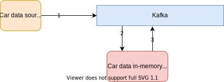
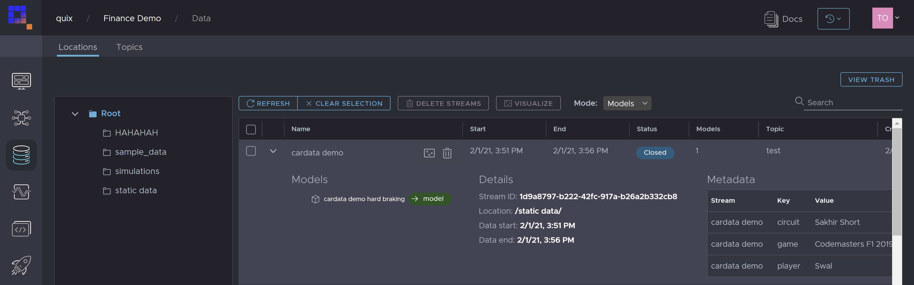
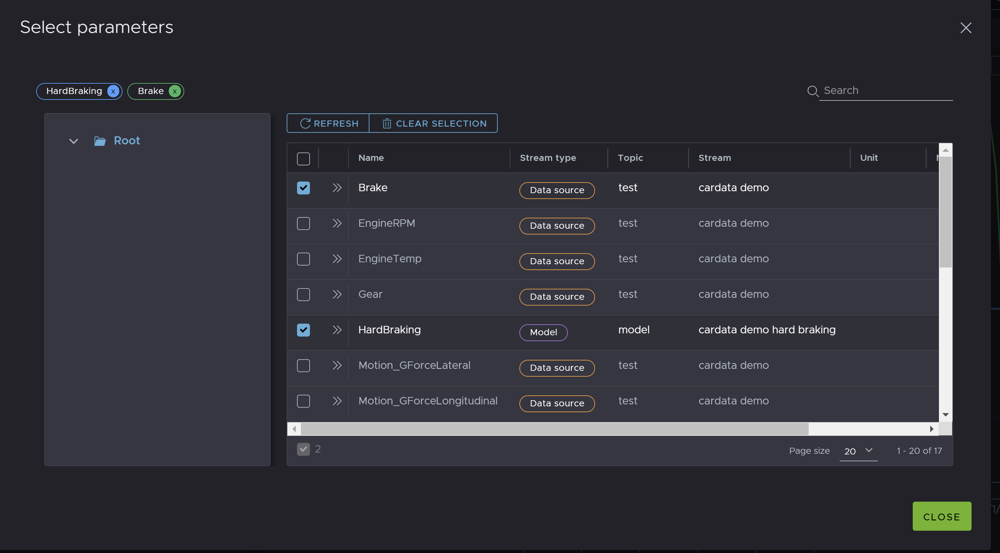

# Example model
This is an example of how to build a simple in-memory function that will continuously process live data. We will use the Quix SDK and a pub/sub pattern to read data from a Kafka topic to the model, and write the model output back to a new Kafka topic.
 
[](doc/car-demo-model.svg "Architecture") 

1) Raw telemetry data is streamed from a car into the input topic.
2) The model subscribes to the input topic read the raw data into memory, live.
3) The results from the model function are streamed to an output topic.

## Code walkthrough 

The Quix SDK is designed to help you react to individual streams coming from multiple individual sources (like cars). 

To process an incoming stream:

```python
# Callback called for each incoming stream
def read_stream(new_stream: StreamReader):
  # Inside this method you react to each incoming stream individually.
  return

# Hook up events before initiating read to avoid losing out on any data
input_topic.on_stream_received += read_stream
input_topic.start_reading()  # initiate read
```

In this example we will create one output stream (with the result of our function) for each incoming stream. We will also attach the new stream as a child of the input stream to maintain data lineage. 

```python
# Create a new stream to output data
stream_writer = output_topic.create_stream(new_stream.stream_id + "-hard-braking")
    
stream_writer.properties.parents.append(new_stream.stream_id)
```

In this function, we will listening for data packets with the parameter **Brake** and calculate when the braking force applied exceeds 50%. 

Create a buffer to read **Brake** parameters from the incoming stream. 

```python
buffer = new_stream.parameters.create_buffer("Brake")
buffer.time_span_in_milliseconds = 100  # React to 100ms windows of data.

# Callback triggered for each new data frame
def on_parameter_data_handler(data: ParameterData):

    df = data.to_panda_frame()  # Input data frame
    output_df = pd.DataFrame()
    output_df["time"] = df["time"]

    output_df["TAG__LapNumber"] = df["TAG__LapNumber"]
    print(df)

    # Calculate when braking force > 50% and send True as an output.
    output_df["HardBraking"] = df.apply(lambda row: "True" if row.Brake > 0.5 else "False", axis=1)  

    # Send filtered data to output topic
    stream_writer.parameters.buffer.write(output_df)  


# React to new data received on the input topic.
buffer.on_read += on_parameter_data_handler
```

See complete code example in [source/main.py](source/main.py).

## Result
**If persistence on your input and output topics is enabled**, the raw telemetry data and the result of the function will be persisted to the catalogue where you can view all the data together. 

[](doc/model-catalogue.png "Model in data catalogue")


[](doc/model-parameters.png "Model parameters in parameter browser")

## Deployment
This model can run locally or in Quix serverless environment. To learn how to deploy services in Quix please see our [doc](https://documentation-40c5b57b-a938-4925-93a9-25df5a64e54f.platform.quix.ai/deploy/).

## What next
You can build a dashboard to visualize and share the raw and processed data. See [car-data-dashboard](https://github.com/quixai/car-data-dashboard)
